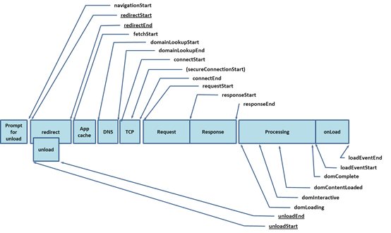

# 前端性能指标

## 以用户为中心的性能指标（Google力推）

主要从4个反馈来描述页面性能，其所对应在用户体验而言，十分重要的4个问题

- `FP/FCP` 是否发生 -> 开始了吗
- `FMP`    是否有用 -> 有用吗
- `TTI`    是否可用 -> 能用吗
- `LongTask` 是否流畅->好用吗

### 首次渲染 First Paint( 以下简称FP)

客户端的第一个像素点绘制时间，通常用来判断页面是否发生、是否加载、服务器是否有响应、导航跳转是否成功启动、跳转时间的间接判定等

### 首次内容渲染 First Contentful Paint (以下简称FCP)

客户端第一次有内容的绘制，一般与FP一起，二者选其一。和FP不同的是，FCP所标示的是来自DOM中的内容：文本、图片、Canvas、SVG 等。

### 首次有效内容渲染 First Meaningful Paint (以下简称FMP)

目前也无规范指定哪些是有效内容，这是由开发者自己决定。只有他们自己才知道哪些对用户而言是有用的，这些重要的部分通常称为主要元素。如果实在无法理解，可以想象一下在DOM中BODY最前面的一个元素内容被渲染的时间。

网页中总有一部分内容的重要性大于其余的部分。如果这部分的内容能够很快地被加载出来，用户甚至都不会在意其余部分的加载情况。

### 可互动时间 Time to Interactive(以下简称TTI)

表示页面已经呈现了画面，并且能够响应用户输入的时间点。也可以是JavaScript完成了初始化，主线程处于空闲的时间点。

由此可以获取性能常见问题：
- 被JavaScript操作的元素还未被加载出来
- 一些响应慢的会话阻塞了主线程
- 耗时任务 LongTask
- 放弃加载 Application Close

如果页面的加载时间过长，用户通常会选择离开。不幸的是，这意味着我们所有的性能指标都存在着幸存者偏差的问题，我们所搜集到的数据将不包括那些没能等到页面加载完成的用户（这意味着我们可能不能捕获一些性能过低的数据）。

当我们不能跟踪这些用户的过低性能数据时，我们可以跟踪这些情况发生的频率，以及用户停留在页面的时间。

## Performance 类

> Attention: This interface of this property is deprecated in the Navigation Timing Level 2 specification. Please use the PerformanceNavigationTiming interface instead.

- performance.navigation 对象提供了在指定的时间段里发生的操作相关信息，包括页面是加载还是刷新、发生了多少次重定向等
- performance.timing 对象包含延迟相关的性能信息
- performance.timeOrigin 返回性能测量开始时的时间的高精度时间戳。
- performance.memory 是 Chrome 的非标准扩展，可以获取到基本内存使用情况。


## Navigation Timing

Navigation Timing 所建议的是浏览器加载页面时一个完整的生命周期。目前主流浏览器都遵循此标准，不排除会有个别浏览器有特殊的处理方式。图中箭头所对应的标记，会记录在 window.Performance（以下简称 performance）中，表示该操作执行的时间。



> 来源于 [w3c.org](https://www.w3.org/TR/navigation-timing/)


### Prompt for unload 提示卸载

判断上一个页面是否还存在，然后发送卸载指令，此时会触发浏览器的 beforeunload 、unload 事件，在这里可以做一些收尾工作，如埋点统计。

如果卸载被中止，将不会更改 timing 和 navigation。反之，将当前时间标记更新到navigationStart，即 performance.timing.navigationStart。
当前页面非同源跳转，unloadEventStart和 unloadEventEnd都为0。否则unloadEventStart记录的是上一页面卸载事件触发的时间。
 
### Redirect 重定向

redirectStart为第一个HTTP重定向开始的毫秒时间戳,通常是表单提交后的重定向，比如登录注册等跳转。如果重定向没有发生，或者其中一个非同源，则该值为 0。同源的限制导致该场景应用较少。（反正我是没找着，欢迎补充）
 
### App cache 加载缓存

卸载完成后判断是否有缓存和是否允许脱机浏览，在开始检查任何相关的应用程序缓存之前标记FetchStart，然后查找本地离线文件、本地临时文件、代理服务器缓存，根据文件Header中的 Expire、Cache-Control、Last-Modify、Etag来决定缓存文件是否生效。
 
### DNS 域名解析，查找DNS本地缓存

浏览器开始检查当前域名的DNS之前的标记 domainLookupStart 。如果因为任何原因没有去检查DNS，即浏览器使用了缓存，持久连接，或者本地资源，start和end均不生效并等于FetchStart。

此处可以用 dns-prefetch来做跨域的DNS 预解析，再配合CDN，但是也不能滥用。相反的，在meta中对x-dns-prefetch-control设置为off则可禁止页面上跨域的DNS预解析。
 
### TCP 建立TCP连接

当浏览器开始于服务器连接时标记为 connectStart。如果资源来自缓存或者没有建立连接，例如持久连接），start 和 end 均不生效并等于 DNS 中的 domainLookupEnd。

如果连接失败，并重新连接，则 connectStart 和 connectEnd 返回新连接的相应时间。
connectEnd 包括建立 TCP 连接的时间以及其他时间，例如 SSL 连接和 Socks 验证。当 TCP 需要建立 SSL 安全会话时，开始时间标记为 secureConnected，如果没有或者已经建立，则为0。

需要注意的是：domainLookupStart, domainLookupEnd, connectStart and connectEnd 都没有生效时，它们跟 FetchStart 的值是相同的。
 
### request | response 

客户端开始从服务器端【包括缓存、本地资源】请求资源/收到响应。这里的时间戳是指对html的请求和响应，不包括脚本、样式表、其他类型的资源。

- requestStart 表示开始请求资源，这里没有 requestEnd
- responseStart 表示收到响应的第一个字节
- responseEnd 表示接收到当前文档最后的字节之后或在连接关闭之前（以先到者为准）
 
### Processing 

对HTML进行下载、解析、渲染等。

### domLoading 

表示document对象创建完成。

### domInteractive

文档解析完成，包括同步加载的文件（除了使用defer或者async属性异步加载的情况）。

### domContentLoadedEventStart

表示浏览器完成所有脚本的下载和解析（包括defer属性，不包括async），并且eventLoop启动，开始执行脚本。

### domContentLoadedEventEnd

表示所有Dom元素节点的创建完成，并且执行所有的同步脚本， eventLoop中没有异步事件需要加入，通常是JavaScript类库中onready事件触发的时机。

### domComplete

执行完所有的eventLoop异步队列事件（包括图片）。通常是onload事件触发的时机。
 
需要注意一点：DOM事件中并没有提供onready事件监听，所以JavaScript类库如JQuery仅模拟该行为。当页面没有大文件异步加载时， onload会先于onready执行。

先>后：MutationObserver = promise.then > ready > onLoad ;  setTimeout等宏任务不在讨论范围；
 
### onLoad

- loadEventStart 该属性是onload事件触发前
- loadEventEnd 该属性表示onload事件执行完成

这两个指标比较特殊，由于是在脚本加载完成之后即将触发onload后才开始标记，所以如果在onload 事件触发之前调用，则为0。

示例：
``` js
window.onload =function () {
    console.log(‘load=’,1)
}
console.log(‘loadEventStart=’,performance.timing.loadEventStart)
// loadEventStart= 0
// load= 1
```
## prolyfill
 
Performance 接口可以获取到当前页面中与性能相关的信息。它能精准获取当前页面的各个指标所花费的时间，而传统的Date getTime() 总是差那么一点，因为这是由JS解析和执行导致的时间差，但这不妨碍我们用来做 prolyfill。
 
``` js
function dom_load(){
        const {domComplete,navigationStart} = performance.timing;
        const dom_load = domComplete - navigationStart;
        return `页面加载时间为：${dom_load}`;
}
// prolyfill
var start = new Date().getTime(); //获取开始加载时间
function dom_load() {
        var now = new Date().getTime(); //获取加载结束时间
        var dom_load = now - start;  //页面加载时间
        return `页面加载时间为：${dom_load}`;
}
```

