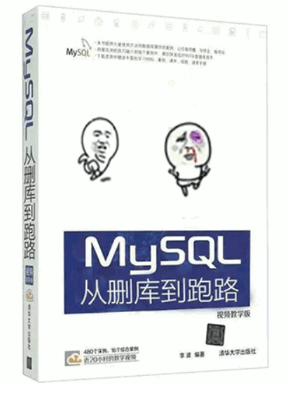
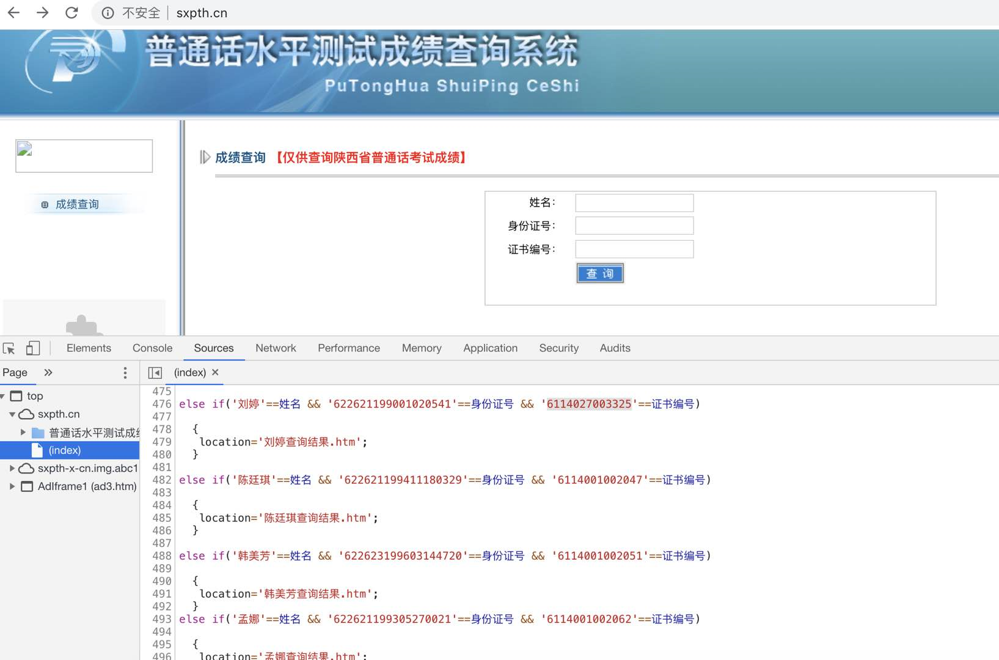

# 前端开发中一些的技巧

## 序言

一行代码能做什么？

> sudo rm -rf /*





End

> 开个玩笑，不要打我


### 进入正题

编程也是需要思考的，可是开发周期那么短，设计又需要花时间，哪来那么多时间？但是，没有时间，根本不能成为你写一堆烂码的借口。缺少思考，缺少成熟的解决方案，才是最根本的问题。难道你甘心写出一堆乱糟糟的代码，把你的 “光辉” 历史刻在 git 仓库上吗？

> 程序员必须为了让人能阅读代码而书写代码，而机器执行只是顺便的。
> It doesn't help to bake a lovely cake if you've frosted it with shit.




我先列举一下平时开发中经常出现的代码片段，相信以下代码并不少见：

``` js
/** case : 布尔值 */
if( isLock == true ){
    return true;
} else {
    return false
}
/** case : 判断当前支付类型 */
if( item.payType == 1 || item.payType == 2){/** done */}
/** case : 判断后端是否返回某字段 */
if( data.payType && data.payType2){/** done */}
/** case : 对接口返回的数据进行操作 */
if( response.status == 200 && response.data!= null){
    if(response.data.list.length>=0){
        let data = response.data.list;
        for(let i=0;i<data.length;i++){
        /** done */
        }
        alert('操作成功');
    }else{
        alert('暂无数据');
    }
}else{
    alert('网络异常');
}
```

以上代码并没什么毛病，业务逻辑确定是这样，条理清晰。

实际上，当业务代码越来越多，比如一开始只有 刷卡支付，慢慢加入了银联支付，然后是微信、支付宝、花呗、QQ钱包、信用卡、京东支付、美团支付、京东白条分期............

那你的代码可能会变成：
``` js
/** 10种支付中，只有6种符合的情况下 */
if( item.payType == 1 
    || item.payType == 3
    || item.payType == 4
    || item.payType == 6
    || item.payType == 7
    || item.payType == 9
){
    /** done */
}
/** 产品设计 6666 的系列 */
if( (item.payType == 1 && item.regType == 2 && item.state == 1)
 || (item.payType == 2 && item.regType == 4 && item.state == 2)
 || (item.payType == 3 && item.regType == 5 && item.state == 3)
 || (item.payType == 4 && item.regType == 4 && item.state == 4)
 || (item.payType == 5 && item.regType == 3 && item.state == 5)
 || (item.payType == 6 && item.regType == 1 && item.state == 6)
){
 /** done */
}
```

> 条理清晰 微笑.jpg

有些人说写 React 就像回到了以前 JQuery 拼装 HTML，我是不信的。直到我看到这些代码：

``` jsx
this.channelTypeTH=(
    <Popover
        content={
            <div style="padding:10px">
                <p>{'公有机构：指配置渠道号的机构'}</p>
                <p>{'私有机构：指配置自有渠道号的机构'}</p>
            </div>
        }
    >
        <Icon type="question-circle" />
    </Popover>
);
this.orgStatusTH=(
    <Popover
        content={
            <div style="padding:10px">
                <p>{'启用：表示当前使用该机构'}</p>
                <p>{'禁用：表示当前未使用该机构'}</p>
            </div>
        }
    >
        <Icon type="question-circle" />
    </Popover>
);
```

其实我一直很相信，没有人愿意写一大段冗长的代码。像这样的代码，基本都是历史遗留，经过几百手写出来的。


## 基础优化 

其实优化代码并不难，看了序言部分，对于优化的方案也就呼之欲出了：即简化代码逻辑，抽出相同的功能、相同的代码片段，通过传参等方式，减少冗余，提高代码复用性。

这里有两条书写整洁函数的黄金定律：
- 代码应该少
- 函数应该专注做一件事，并且做精

## 简化代码

### 优雅的 return

函数返回值可直接 return 时不要拖泥带水，对于递归的 `return` 必须为计算后的值，即尾递归调用优化；

``` js { 9 }
/** bad */
function _case1( flag){
    let isLock = flag === 1;
    if ( isLock === true) return true;
    else return false;
}
/** good */
function _case2( flag){
    return flag === 1;
}
```

案例中直接 return 需要注意是否为 Boolean 类型，如不是，可通过强制类型转换来避免出现一些意外情况。

以下是某项目中的例子，小伙伴们可以思考一下怎么把函数体简化？

``` js
/** 如何简化？ */
const isPhone = data => {
    let res = /^1[3456789]\d{9}$/;
    let flag = false;
    if( !res.test(data)){
        flag = false;
    }else{
        flag = true;
    }
    return flag;
}
```

### 善用表达式

赋值使用 `三元表达式` `||` `&&` `?.` `??` `?!`， 
需要注意的是三元表达式不能嵌套3层以上。

``` js
/** bad */
if ( data.status == 200 ){ 
    target = data.list;
}else{
    target = others.list;
}

/** good */
let target = data.status == 200 ? data.list : others.list;
// or 
let target = 'abc' || 'bcd'; // target: 'abc';
// or
let target = 'abc' && 'bcd'; // target: 'bcd';

```


### 巧用数组

当遇到同一个字段的判断，判断条件简单的罗列部分可能性时，使用数组来解决判断链过长的问题
``` js
/** bad */
if( item.payType == 1 || item.payType == 3 || ... ) //省略号表示省略了N多个判断

/** good */
let result = [1,3,5,6,8].includes(item.payType); // result: {Boolean}
//let result = [1,3,5,6,8].indexOf(item.payType); // result: {INT}
```

也可以使用 indexOf，需要注意它返回了一个索引值，具体还是看自身业务的需求吧。

### 使用正则表达式

由于大部分前端都不写正则，不过用正则可以精简很多代码

``` js
/** bad */
if( data.payType && data.payType2 && ......){/** done */}
/** good */
let keyNames = Object.getOwnPropertyNames(obj); // Array[String]
let result = usedPayType.match(/payType/g); // Array[String]
```

估计看到这，会有一些人问，业务场景更复杂怎么办？比如 `payType` 的序号不连续，或者根本不是相同的字段名，不是直接挂了吗？

给数字加逗号的，正则就可以轻易解决，可以不用 for 循环。取一段项目中的代码：

``` js
/** bad */
// 千分符，保留2位小数
const toThousands = (num, isInput) => {
    var num = (num || 0).toString(), result = '';
    num = num.replace(/[^0-9]/ig, "");
    if (num.length < 6) {
        result = (num / 100).toFixed(2);
    } else {
        var point = num.slice(-2);
        num = num.slice(0, num.length - 2)
        while (num.length > 3) {
            result = ',' + num.slice(-3) + result;
            num = num.slice(0, num.length - 3);
        }
        if (num) { result = num + result + '.' + point; }
    }
    if (num == 0 && isInput) {
        result = '';
    }
    return result;
}
/** good */
// 使用正则：
let test1 = '123456789.01';
let format = test1.replace(/\B(?=(\d{3})+(?!\d))/g, ',');
console.log(format)// 1,234,456,789.01
//这个正则不支持小数点后3位，思考下如何改进吧~
```

> 你对正则的力量一无所知

### 使用位运算 

位运算是效率最高的代码，JavaScript 的运算最终都是转换成位运算。这里列举一些平时经常看到的一些代码：

``` js
Math.floor(5.61321) // @return: 5
Math.floor(7/2) // @return: 3
7%2 // 判断奇偶

// 如果是位运算的话
~~5.61321  // 取整： 5
5.61321>>0 // 取整: 5
~~(7/2) // 除2取整: 3
7>>1 // 除2取整: 3
111 & 1 === 1 // 判断奇偶：true-奇数，false-偶数
```

### 变量交换

使用 ES6 的语法，来移除在变量交换时产生的中间量。语法不支持？没关系，还可以用位运算。

```  js
let a = 1 , b = 2;
/** bad */
let c = a; a = b; b = c;
/** good */
[a,b] = [b,a]; 

// 位运算中的变量交换
a ^= b;
b ^= a;
a ^= b;
```

### 避免副作用

避免在没有结构的对象间共享状态，使用可以被任意修改的易变的数据类型，没有集中处理发生的副作用等。如果你能做到，你就能比其他编程人员更愉快。

``` js
/** bad */
var name = 'Temporary';
function splitName() {
  name = name.split(' ');
}
/** good */
function splitName(name) {
  return name.split(' ');
}
```

### 键值对

这里引入一个术语，叫 key-val (键值对)。

我想问下，咱们公司还有多少人停留在面向过程开发？抽象化是开发的基础常识，即面向对象编程。如果连面向对象编程都很难入手，那你必须下一番苦功夫了。

我们来看下项目中的例子：通过后端数据渲染的活动列表，每项活动【点击】处理不同的业务以及对应详情页跳转

``` html
// wxml
<view wx:for="{{item in dataList}}">
    <button bindtap="jumpToInfo">跳转详情</button>
</view>
```

> 如果你的第一反应是使用 switch 、if 实现..
``` js
// switch 同理
function jumpToInfo(item){
    if( item.activityType ==1 ){ /** 省略了100行代码 */ }
    else if( item.activityType ==2 ){ /** 省略了100行代码 */}
    else if( item.activityType ==3 ){ /** 省略了100行代码*/}
    else { /** 省略了100行代码 */}
}
```

看看简单的键值对怎么写：

```js
// 创建一个简单的对象来存储事件的 key
const keyVal = {
    0: 'handleDefault', //定义默认事件的key
    1: 'handle1',
    2: 'handle2'
}
function jumpToInfo(key, item){ //代理转发
    let _handle = 'handleDefault';
    if(key in keyVal) {
        _handle = keyVal[key];
    }
    return this[_handle].call(this,item);
}

// 小程序 .js
Page({
    handleDefault(item){/** 省略了100行代码 */}
    handle1(item){/** 省略了100行代码 */}
    handle2(item){/** 省略了100行代码 */}
})
```

